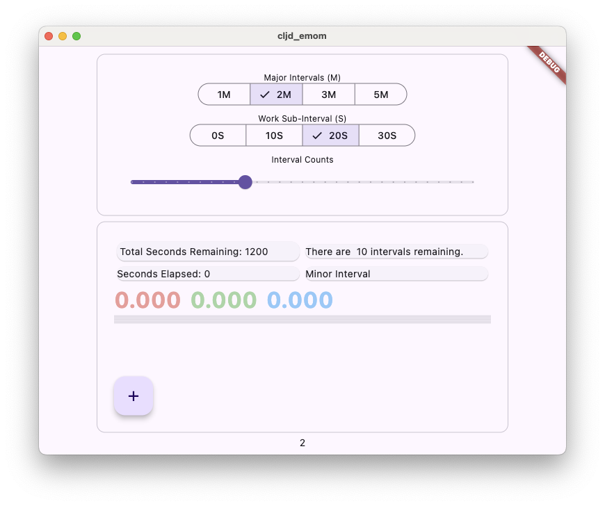
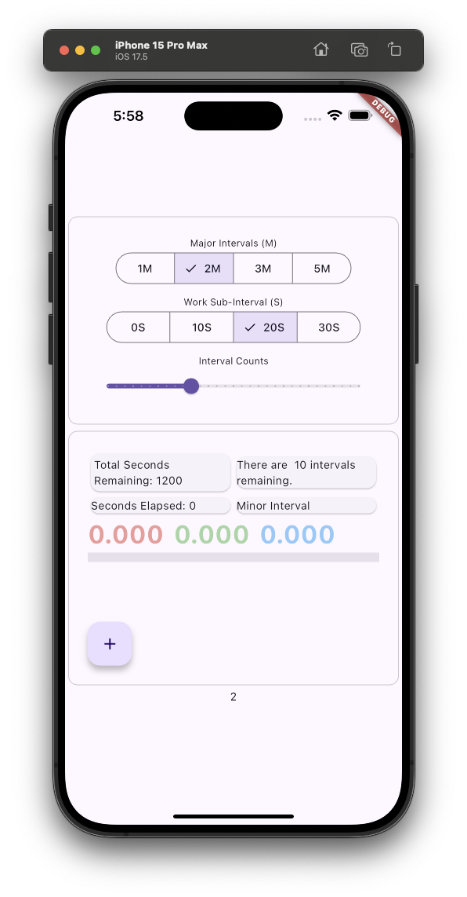

# Every Minute on the Minute

Experiment with ClojureDart + flutter. Main idea was to create an interval app that would allow you to specify intervals and subintervals - e.g. work the first 30s of a 2Min interval; do that 10 times. 

```sh
# terminal 1
clj -M:cljd watch
# terminal 2
flutter run
```


## Status:  incomplete






## Quick Impressions

- Flutter is really powerful and can create nice looking, performant cross-platform apps
- ClojureDart is a nice wrapepr arund Dart.
- The `f/widget` macro is very powerful and condenses down a lot of code but you definitely need to undertand Flutter a but - how the widgets are constructed and when to use `.child` or `.children`. Its not bad when you get used ot it but I hit a lot of errors at first.
- App state and widget state took a bit to grok - where/how do you put local variables vs. global variables.
- The [clojuredart samples](https://github.com/Tensegritics/ClojureDart/tree/main/samples) are good but they are isolated. I found the fixxbuzz helpful for showing me `Streams` but I had to ask for some help on how to make a [Segmented Button](https://m3.material.io/components/segmented-buttons/overview)
- Flutter is a complete ecosystem - web knowledge etc won't translate except in the abstract (e.g. nexting of dive elemets).
- Within a widget tree let-bound varaibles can be used correctly.
- I didn't use or try any of the more advanced tools - e.g. use of Keys to speficfy widgets or the `f/$` command.
- I used a stream ticker to invoek periodic updates but I'm not sure thats a good/best way to do this.
- I definitely didn't have a good sense of idiomatic when it comes to things like propgating styles across/down widget trees.
- I spent a lot of time getting both the UI and the logic to work before things started to "click" but now I need to move on. 
- A cljd version of the [material_3_demo](https://flutter.github.io/samples/web/material_3_demo/) ([src](https://github.com/flutter/samples/tree/main/material_3_demo)) would have been very helpful in getting me started as I would have been able to jump start into doing useful fluttery work quite quickly.
- Fast reloads are great: you really need to keep reloading all the time. A few times I borked my parens and had a non-working app. Small changes and refresh on every change is the way to go.

